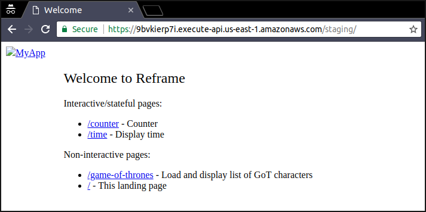

<p align="center">
  <a href="https://github.com/AurelienLourot/reframe-on-up">
    
  </a>
</p>
<p align="center">
  <b>Reframe on Up</b>
</p>
<p align="center">
  How I deployed for free a Reframe web app on Up in less than an hour
</p>
<p align="right">
  <a href="https://github.com/AurelienLourot">AurelienLourot</a> - 20 Jun 2018
</p>

In the first part of this [series](../readme.md) I show how I

* created a [Reframe](https://github.com/reframejs/reframe) web app,
* set up my AWS account,
* set up my AWS CLI client,
* set up my [Up](https://up.docs.apex.sh/) client, and
* deployed my app on [AWS Lambda](https://docs.aws.amazon.com/lambda/latest/dg/welcome.html) via
  Up.

# Step-by-step guide

## Creating a Reframe web app

1. Install Reframe:

```bash
$ mkdir ~/myapp/
$ cd ~/myapp/
$ echo {} > package.json
$ npm install @reframe/cli --save
...
+ @reframe/cli@0.1.13
...
```

2. Create a Hello World:

```bash
$ npx reframe init .
```

Unfortunately `reframe init` overwrites our [package.json](package.json), thus removing our
dependency to `@reframe/cli`. This is because Reframe is designed to be installed globally on your
system, but I personally prefer to install it locally in the project as a dependency, which is also
needed in order to deploy it to Up.

Fix this by editing your [package.json](package.json) and making sure it looks like:

```json
{
  "dependencies": {
    "@reframe/cli": "^0.1.13",
    "@brillout/fetch": "^0.1.0",
    "@reframe/react-kit": "0.1.13",
    "react": "^16.3.2"
  }
}
```

3. Run your app locally:

```bash
$ npm install
$ npx reframe start
...
 ✔ Server running (for development)
     http://localhost:3000/ -> WelcomePage
     http://localhost:3000/counter -> CounterPage
     http://localhost:3000/game-of-thrones -> GameOfThronesPage
     http://localhost:3000/time -> TimePage
```


## Making your app Up-compatible

4. Define `npm start` in your [package.json](package.json):

```json
{
  "scripts": {
    "start": "reframe server"
  },
  "dependencies": {
    "...": "..."
  }
}
```

> **NOTES**:
>
> * `reframe start` is pretty much like `reframe build && reframe server` and you'll want:
>   * to run `reframe build` locally, then
>   * to send the build output to AWS, and then
>   * to have AWS run `reframe server`.
> * The default Reframe server:
>   * listens at `PORT` if that environment variable is defined,
>   * listens at 3000 otherwise.
> * Up creates an AWS Lambda function that:
>   * runs `npm install`, then
>   * runs `PORT=<some number> npm start`, then
>   * waits for your app to behave like an HTTP server listening at `PORT`, and then
>   * exposes it to the world over HTTPS.

## Setting up your AWS account

5. Create an IAM user `myuser` and an access key for it. We will need it in order to use the AWS
   CLI.

See the
[AWS documentation](https://docs.aws.amazon.com/cli/latest/userguide/cli-chap-getting-started.html)
for more details.

6. Attach the `IAMFullAccess` policy to `myuser` so you can run commands like
   `aws iam create-group ...` later.

7. Install and configure the AWS CLI:

```bash
$ sudo pip install awscli
$ aws configure
AWS Access Key ID [None]: ********
AWS Secret Access Key [None]: ********
Default region name [None]: us-east-1
Default output format [None]:
```

8. Create a file [aws/apex-up-policy.json](aws/apex-up-policy.json) containing the
   [IAM policy recommended by Up](https://up.docs.apex.sh/#aws_credentials.iam_policy_for_up_cli):

<details>
  <summary>
    <code>aws/apex-up-policy.json</code>
  </summary>
  <br/>
  <div class="highlight highlight-source-json">
    <pre>
{
    "Version": "2012-10-17",
    "Statement": [
        {
            "Effect": "Allow",
            "Action": [
                "acm:*",
                "cloudformation:Create*",
                "cloudformation:Delete*",
                "cloudformation:Describe*",
                "cloudformation:ExecuteChangeSet",
                "cloudformation:Update*",
                "cloudfront:*",
                "cloudwatch:*",
                "ec2:*",
                "ecs:*",
                "events:*",
                "iam:AttachRolePolicy",
                "iam:CreatePolicy",
                "iam:CreateRole",
                "iam:DeleteRole",
                "iam:DeleteRolePolicy",
                "iam:GetRole",
                "iam:PassRole",
                "iam:PutRolePolicy",
                "lambda:AddPermission",
                "lambda:Create*",
                "lambda:Delete*",
                "lambda:Get*",
                "lambda:InvokeFunction",
                "lambda:List*",
                "lambda:RemovePermission",
                "lambda:Update*",
                "logs:Create*",
                "logs:Describe*",
                "logs:FilterLogEvents",
                "logs:Put*",
                "logs:Test*",
                "route53:*",
                "route53domains:*",
                "s3:*",
                "ssm:*",
                "sns:*"
            ],
            "Resource": "*"
        },
        {
            "Effect": "Allow",
            "Action": "apigateway:*",
            "Resource": "arn:aws:apigateway:*::/*"
        }
    ]
}</pre>
  </div>
</details>
<br/>

9. Apply this policy to `myuser`:

```bash
$ aws iam create-policy --policy-name apex-up \
  --policy-document "file://$(pwd)/aws/apex-up-policy.json"
{
    "Policy": {
        "PolicyName": "apex-up", 
        "...": "...", 
        "Arn": "arn:aws:iam::123456789012:policy/apex-up", 
        "UpdateDate": "2018-06-17T21:33:24.495Z"
    }
}
$ aws iam create-group --group-name apex-up
$ aws iam attach-group-policy --group-name apex-up \
  --policy-arn arn:aws:iam::123456789012:policy/apex-up
$ aws iam add-user-to-group --group-name apex-up --user-name myuser
```

## Setting up Up

10. Install Up:

```bash
$ curl -sf https://up.apex.sh/install | BINDIR=. sh
apex/up: checking GitHub for latest version
apex/up: found version 0.6.8 for linux/amd64
...
$ ./up

     Project name: myapp
     AWS profile: default
     AWS region: US East (N. Virginia)
...
```

11. Reduce the allocated memory to the minimum by adding this to your [up.json](up.json):

```json
{
  "...": "...",
  "lambda": {
    "memory": 128
  }
}
```

12. Create useful npm scripts in your [package.json](package.json):

```json
{
  "scripts": {
    "...": "...",
    "deploy": "reframe build && ./up && ./up stack status && ./up url",
    "undeploy": "./up stack delete"
  },
  "dependencies": {
    "...": "..."
  }
}
```

## Deploying your app

13. Enjoy :)

```bash
$ npm run deploy
...
https://9bvkierp7i.execute-api.us-east-1.amazonaws.com/staging/
```



As you can see the app is a bit broken though. This is because it has links like `href="/counter"`
instead of `href="/staging/counter"` or `href="counter"`, as our app is exposed at
https://address/staging/.

Unfortunately this last part (`staging/` or `production/` or any other stage name) can't be remove
except by setting up a custom domain, see

* the [AWS documentation](https://docs.aws.amazon.com/apigateway/latest/developerguide/how-to-custom-domains.html)
* the [Up documentation](https://up.docs.apex.sh/#faq)
* this [StackOverflow question](https://stackoverflow.com/a/39540844/1855917)

At this point, you can simply take this into account in your `href=` and `src=` attributes when
developing your own app or set up a custom domain.

⇒ [Part II: How I set up a custom domain for my Reframe web app](../02-custom-domain/)

<br/>
<p align="right">
  <b>Thanks</b> to <a href="https://github.com/brillout">brillout</a> for reading drafts of this.
</p>
